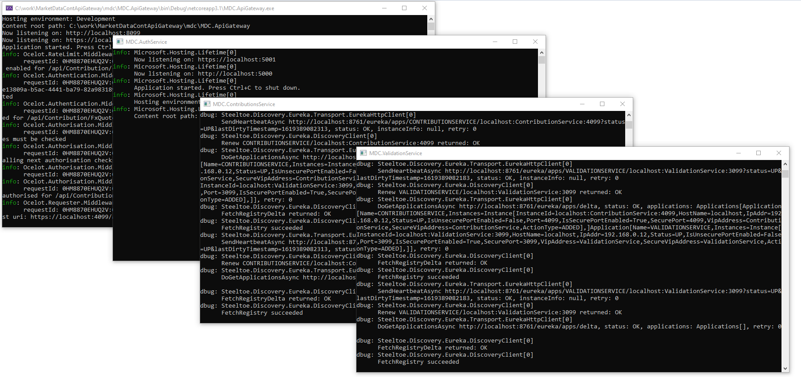
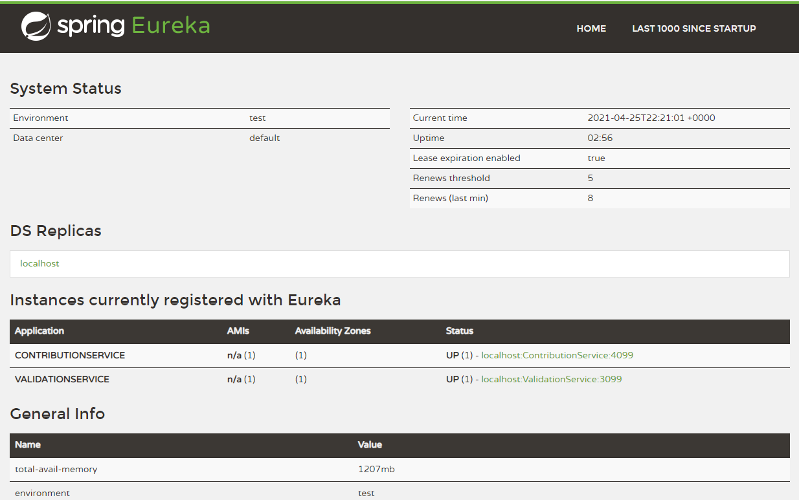
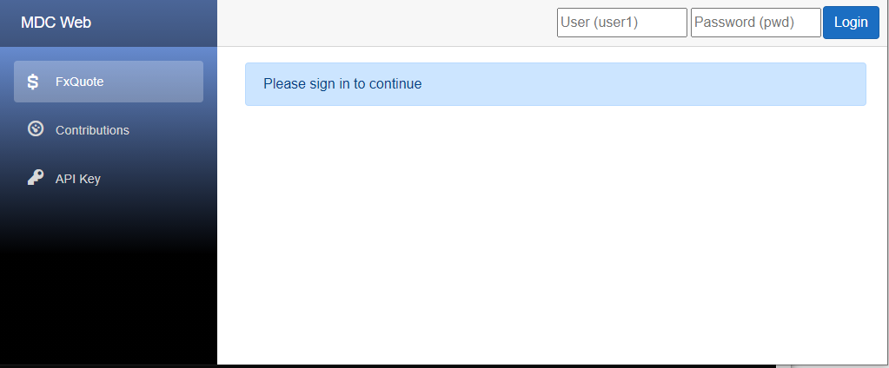
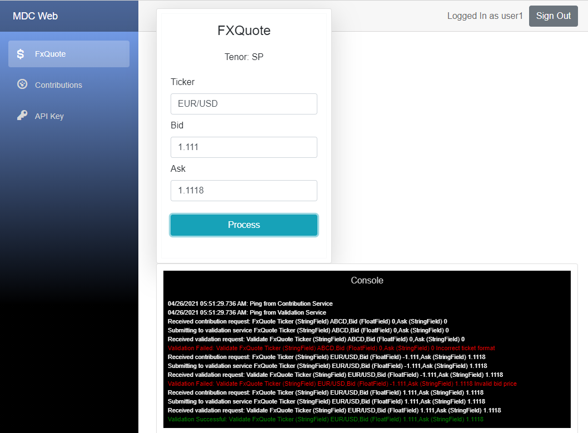
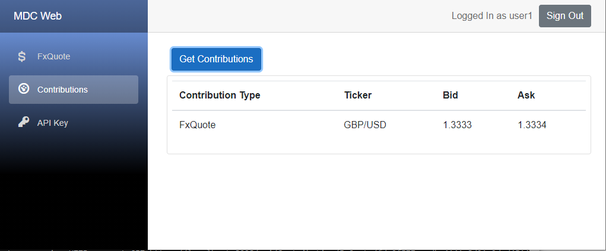
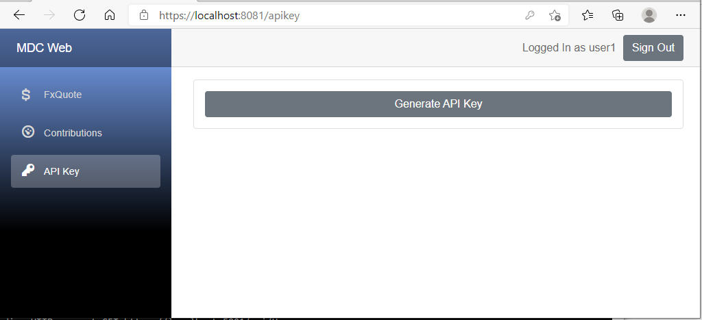

# Market Data Contribution API Gateway (mdc)
### A microservices based .net core API

## Highlights
* Ocelot for API Gateway
* Spring Euereka for service discovery
* Rabbit MQ message bus integration (pending)
* JWT Token authentication
* Blazor Test GUI - can be used to:
  * Process contributions
  * Retrieve contributions
  * Generate API Key that can be used bu other clients to talk to the API Gateway

## Starting 
For starting all services manually, please ensure to run Euerka using following docker command first:
> docker run --publish 8761:8761 steeltoeoss/eureka-server

After starting Eureka, start all services. Docker Launch configs are not ready yet, so please use project launch config to launch.

### Services

## Service Discovery

## Authenticate in GUI

## Contributions
Real time messages from all services are received by the GUI. See validation messages on current and previous tries in the console window.

## Fetch Contributions
More work need to be done here - e.g. querying etc

## API Key generation for other clients

