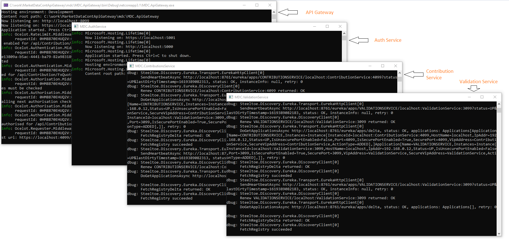

# Market Data Contribution API Gateway (mdc)
### A microservices based .net core API

## Objectives:
#### Since the project is an API gateway, it must have a solid architecture. Our objectives will be:
* Robust loosely coupled architecture
* Service cataloging and discovery
* Low API latency - no blocking service calls. Every response should come over on a real time websocket connection and intra service communication should be done on RabbitMq message bus asynchronously.
* Unified Authentication and Authorization across all services using JWT tokens
* Ability to generate auth tokens from the web GUI

## Highlights
* Ocelot for API Gateway
* Spring Euereka for service discovery
* Rabbit MQ message bus integration (pending)
* JWT Token authentication
* Blazor Test GUI - can be used to:
  * Process contributions
  * Retrieve contributions
  * Generate API Key that can be used bu other clients to talk to the API Gateway
* Non-blocking architecture based on CQRS pattern. Clients send commands and have open subscriptions over websocket to receive updates.

## Architecture

## More to do
* Expose metrics endpoints and plug in Grafana, Prometheus
* Finish Rabbit MQ integration ( was not strictly required for given functionality - fell short of time)
* Use gRPC for ultra low latency
* Hook in Swagger
* Dockerize the setup / Create Helm chart for Kubernetes
* Secrets management

## Building and Starting 

#### Start Eureka

For starting all services manually, please ensure to run Euerka using following docker command first:
> docker run --publish 8761:8761 steeltoeoss/eureka-server
My docker setup is windows 10 docker desktop with a WSL backend (Ubuntu 20.04 LTS distro), but that should not make any difference - any docker setup will work as long as port mappings are not changed in the command above.

#### Build and Start

Prerequisite: 
> See previous step

On windows command prompt execute the following:
> run mdc/BuildAndStartAll.cmd script to restore nugets, build all projects and start them from single file

todo: Fix Docker Launchsettings

Hard coded user credentials for testing the GUI/API
> Login: user1
> Password: pwd

### Services

## Gateway
Ocelot is used for aggregating services into a gateway https://ocelot.readthedocs.io/en/latest/index.html

## Service Discovery
Spring boot Eureka is used for service discovery https://spring.io/guides/gs/service-registration-and-discovery/

## Authenticate in GUI

## Contributions
Real time messages from all services are received by the GUI. See validation messages on current and previous tries in the console window.

## Fetch Contributions
More work need to be done here - e.g. querying etc
Also, contributions are stored in memory - should persist to a durable medium. Some decisions to be made based on retrieval pattern, retention policies etc. I have a feeling that time series databases - TimeScaleDB on PostgressSQL will be a good fit.

## API Key generation for other clients

